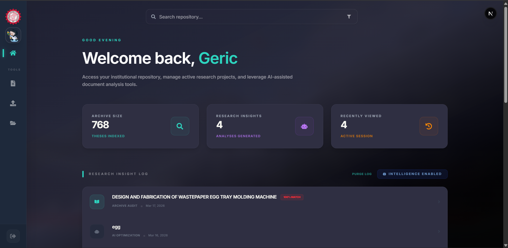
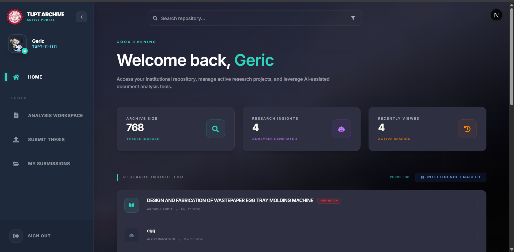

# TUPT Thesis Archive - Web Application

The official web platform for the Technological University of the Philippines Taguig Thesis Archive. A centralized digital repository designed to preserve, manage, and explore years of institutional research excellence.

**🌐 Live Site:** [https://tupt-thesis-archive.vercel.app](https://tupt-thesis-archive.vercel.app)
**🔗 Repository:** [https://github.com/gericandmorty/TUPT-Thesis_ArchiveWeb](https://github.com/gericandmorty/TUPT-Thesis_ArchiveWeb)


---

## 🌟 Features

- **Advanced Search Interface**: Semantic search with real-time suggestions and comprehensive indexing of titles, abstracts, and authors.
- **Interactive Dashboard**: Visualized research analytics using Recharts, showing trends in departments and academic years.
- **Premium UI Design**: Built with Tailwind CSS and Framer Motion for a modern, responsive, and institutional experience.
- **Secure Research Portal**: User authentication for students and faculty to manage their own research submissions.
- **Admin Management**: Dedicated controls for institutional oversight and archive management.
- **Responsive Layout**: Fully optimized for Desktop, Tablet, and Mobile browsers.

---

## 📸 Previews

### 🏛️ Institutional Dashboard


### 🤖 Research Insights & AI Log


---

## 🛠️ Technical Stack

- **Framework**: [Next.js](https://nextjs.org/) (App Router)
- **Language**: TypeScript
- **Styling**: [Tailwind CSS](https://tailwindcss.com/)
- **Animations**: [Framer Motion](https://www.framer.com/motion/)
- **Charts**: [Recharts](https://recharts.org/)
- **Icons**: React Icons (Ionicons, Fa, etc.)
- **Notifications**: React Toastify

---

## 📋 Prerequisites

- **Node.js**: v18.x or later recommended.
- **Backend API**: The [TUPT-Thesis Backend](https://github.com/gericandmorty/TUPT-Thesis_ArchiveNodeBackend) must be running for data fetching.

---

## ⚙️ Setup Instructions

### 1. Clone the Repository
```bash
git clone https://github.com/gericandmorty/TUPT-Thesis_ArchiveWeb.git
cd web
```

### 2. Install Dependencies
```bash
npm install
```

### 3. Environment Variables
Create a `.env.local` file in the `web` directory:
```env
NEXT_PUBLIC_API_BASE_URL=http://localhost:5000
```

### 4. Run Development Server
```bash
npm run dev
```
Open [http://localhost:3000](http://localhost:3000) in your browser.

---

## 📂 Project Structure

- `app/`: Next.js App Router pages and layouts.
- `components/`: Reusable UI components (Navigation, Tables, Charts).
- `lib/`: Utility functions and helper classes.
- `public/`: Static assets (Logos, SVGs, Fonts).

---

## 🤝 Institutional Note

This platform is developed specifically for **TUP Taguig** to modernize the academic research archiving process. All rights reserved by the institutional contributors.
